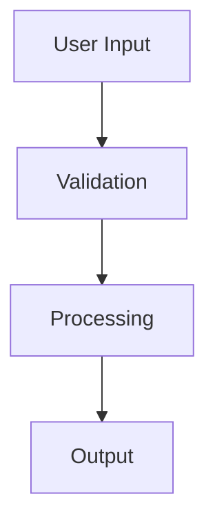

# GitHub Repository Teardown - Usage Example

## Overview

The GitHub repository teardown feature allows clients to send a repository URL and receive a comprehensive analysis including data structures, functions, classes, modules, and mermaid diagrams.

## Client Usage

### 1. Send Repository URL for Analysis

```javascript
// Client sends repo URL to server
const envelope = {
  v: "1",
  id: "uuid-here",
  ts: Date.now(),
  request_id: "req-123",
  direction: "c2s", 
  actor: "claude",
  action: "stream",
  modifier: "start",
  data: {
    query: "", // Can be empty for teardown
    repo_url: "https://github.com/567-labs/instructor.git"
  }
};

socket.emit("c2s.claude.stream.start", JSON.stringify(envelope));
```

### 2. Receive Streaming Response

The server will stream back the analysis in chunks:

```javascript
// Listen for analysis chunks
socket.on("s2c.claude.stream.chunk", (data) => {
  const envelope = JSON.parse(data);
  console.log("Analysis chunk:", envelope.data.delta);
});

// Listen for completion
socket.on("s2c.claude.stream.end", (data) => {
  const envelope = JSON.parse(data);
  console.log("Analysis complete:", envelope.data.finish_reason);
});
```

## Server Process Flow

1. **Cache Check**: Server checks if teardown already exists using repo hash
2. **Git Clone**: If no cache, clones repo to temp directory 
3. **Claude Analysis**: Uses Claude Code SDK to analyze repository structure
4. **File Generation**: Creates `repo_analysis.md` with comprehensive breakdown
5. **Cache Storage**: Saves analysis to `data/{repo-name}-{hash}.md`
6. **Streaming**: Streams markdown file back to client
7. **Cleanup**: Removes temporary directory

## Generated Analysis Includes

- Repository overview and technologies
- Main data structures and their relationships  
- Core functions and execution flow
- Key classes and inheritance patterns
- Module architecture and dependencies
- Mermaid diagrams:
  - Data flow diagram
  - Class diagram 
  - Sequence diagram
  - Module dependency diagram

## Configuration

Environment variables:

```bash
# Required
OPENAI_API_KEY=your-key-here

# Optional (with defaults)
CLAUDE_MODEL=claude-3-5-sonnet-20241022
TEMP_DIR=/tmp  # Uses system default if not set
OPERATION_TIMEOUT=3600  # 1 hour timeout
```

## Example Analysis Output

The generated markdown file will be structured like:

```markdown
# Repository Analysis: instructor

## Repository Overview
Brief description of what the repository does...

## Main Data Structures
### User Class
- Purpose: Represents a user in the system
- Relationships: Connected to Profile, Settings
...

## Core Functions
### authenticate_user()
- Purpose: Handles user authentication
- Flow: Validates credentials → Generates token → Returns session
...

## Visual Diagrams
### Data Flow Diagram

...
```